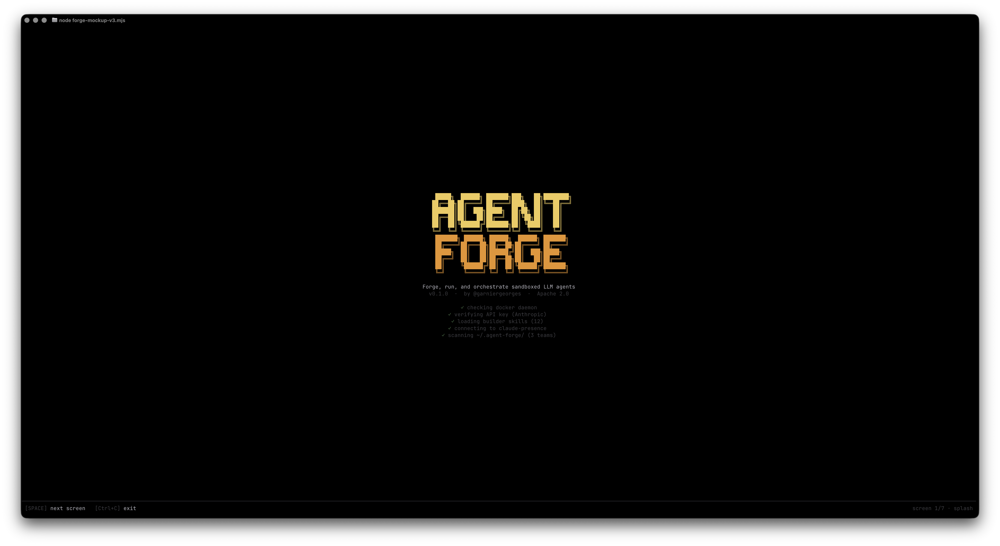
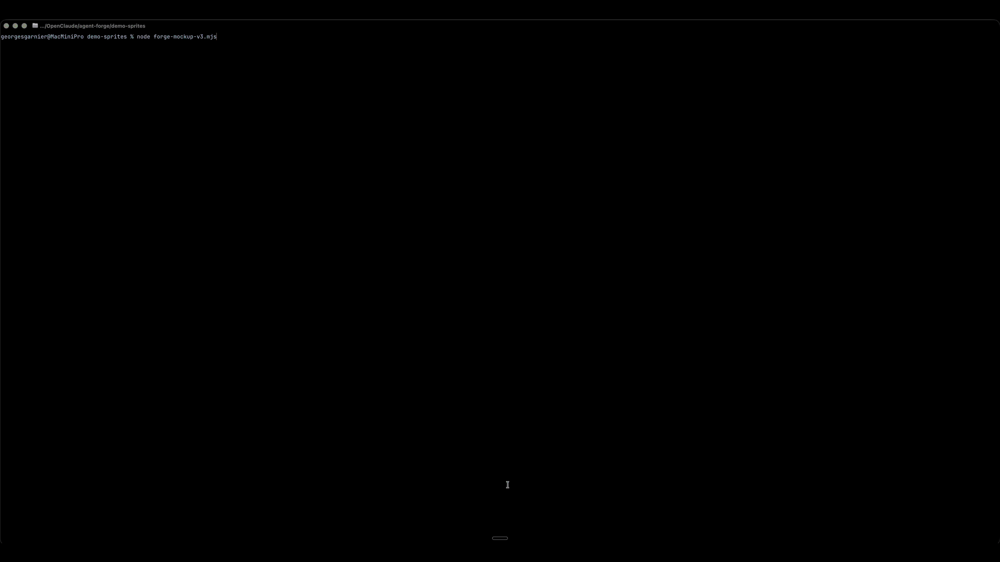

<div align="center">

  

  <br/>

  **Forge, run, and orchestrate sandboxed LLM agents.**

  [](./LICENSE)
  
  

  🇬🇧 English version · [🇫🇷 Version française](./README.fr.md)

</div>

---

> 🚧 **Status — POC, milestones P1 → P6 reached.** You can now `bun run forge`, describe an agent in plain English or French, watch the builder draft the `AGENT.md`, approve it, then ask the builder to run that agent — it spins up its own Docker container with **six native tools** (Bash, FileRead, FileEdit, FileWrite, Grep, Glob) sandboxed under `/workspace`, streams the output, and tears the sandbox down. Recurring orchestration patterns are handled by **skills** : drop a `SKILL.md` in `~/.agent-forge/skills/` (or use the built-in `scaffold-and-run`) and the CLI auto-dispatches when a trigger phrase appears in your message. Next milestone : P5 — hardened sandbox + artifact extraction.

## What is Agent Forge ?

A conversational CLI where you **describe** the software you want and a **builder LLM** designs, writes and launches the agents that produce it — each agent isolated in its own Docker container, with a pixel-art TUI built on [Ink](https://github.com/vadimdemedes/ink).

The builder is the only conversational surface. Sub-agents are spawned on demand in disposable sandboxes ; long-running agents and multi-agent teams come later (P5 and P7).

<div align="center">
  
</div>

## Status — what works today

| Milestone | Scope | State |
|---|---|---|
| **P1** | Hello agent in Docker (host script ↔ container ↔ LLM round-trip) | ✅ done |
| **P2** | Conversational CLI (REPL Ink, EN/FR, slash commands, provider switch) | ✅ done |
| **P3** | Builder writes `AGENT.md`, asks for permission, launches the agent in a fresh container, streams its output | ✅ done |
| **P4** | Six native tools sandboxed under `/workspace` : Bash, FileWrite, FileRead, FileEdit, Grep, Glob ; runtime tool-loop with `maxTurns` | ✅ done |
| **P6** | Skill layer : `SKILL.md` format, catalog (built-in + `~/.agent-forge/skills/`), server-side trigger matching, two-call runner (one for AGENT.md, one for the run prompt) | ✅ done |
| **P5.1** | Hardened Docker sandbox : non-root user, read-only root + tmpfs `/tmp`, `--cap-drop=ALL`, `--security-opt=no-new-privileges`, `--network=none` by default, resource caps (memory / cpus / pids). Permission dialog flags any AGENT.md relaxation. | ✅ done |
| P5.2 | Artifact extraction back to host (`~/.agent-forge/artifacts/<session>/<agent>/`) | next |
| P5.3 | Persistent agents via `docker exec`, lifecycle slash commands | |
| P7 | `TEAM.md` — coordinated multi-agent runs | |
| P8 | Pixel-art dashboard (live agent activity) | |
| P9 | ★ POC validated : Next.js + Laravel + QA demo end-to-end | |

## Quick start

```bash
# 1. Build the base Docker image (one-time, ~600 MB, ~1 min)
bash scripts/docker/build-base.sh

# 2. Install JS deps and build the runtime bundle
bun install
bun run --cwd packages/runtime build

# 3. Configure your LLM provider (cloud — recommended)
cp .env.example .env
# edit .env and set FORGE_API_KEY=…

# 4. Launch the builder REPL
bun run forge
```

On the first run the CLI asks you to pick a language (EN / FR), then drops you into the conversational prompt.

### What the screen looks like

```
 ▌▌ MISSION CONTROL ▐▐    1 action

 ╭──────────────────────────────────────────────────────────────╮
 │  [DONE]  write  agents/haiku-writer/AGENT.md                 │
 │                                                              │
 │      1   ---                                                 │
 │      2   name: haiku-writer                                  │
 │      3   description: Écrit un haïku en 5-7-5.               │
 │      4   sandbox:                                            │
 │      5     image: agent-forge/base:latest                    │
 │      6     timeout: 60s                                      │
 │      7   maxTurns: 1                                         │
 │      8   ---                                                 │
 │      …                                                       │
 │     ✓ written /Users/you/.agent-forge/agents/haiku-writer/…  │
 ╰──────────────────────────────────────────────────────────────╯

                                                            ▀▀▀
                                                            ▀▀▀▀
                                                            ▄ ▄ ▄

 ▌▌ AGENT FORGE ▐▐  v0.0.0  home · new session       session : new · model: mistral-small-latest
 ─────────────────────────────────────────────────────────────────
   ❯ create an agent that writes haikus
   ▸ Done. The agent is forged. Want me to run it ?

 ❯ describe what you want to build…
 [⏎] send  [PgUp/PgDn] scroll  [Ctrl+E] live  [/help] commands
```

The TUI is split in two strict zones :

- **Top zone (Mission Control)** — every concrete action the builder takes. File writes, container launches, agent output. Syntax-highlighted, status-coloured (orange = pending, green = done, red = failed).
- **Bottom zone (Conversation)** — only the natural-language exchange between you and the builder. No code, no logs, no internals.

## Provider configuration

Agent Forge talks to any **OpenAI-compatible** chat endpoint via the [Vercel AI SDK](https://sdk.vercel.ai). Pick what fits.

### Mistral cloud (default — recommended)

Get a key at <https://console.mistral.ai>. The free tier is enough for the POC.

```dotenv
FORGE_BASE_URL=https://api.mistral.ai/v1
FORGE_API_KEY=…
FORGE_MODEL=mistral-small-latest
```

### OpenAI cloud

```dotenv
FORGE_BASE_URL=https://api.openai.com/v1
FORGE_API_KEY=sk-…
FORGE_MODEL=gpt-4o-mini
```

### Local MLX server (Apple Silicon, free, no key)

```bash
python3 -m venv ~/.agent-forge/mlx-venv
~/.agent-forge/mlx-venv/bin/pip install mlx-lm
~/.agent-forge/mlx-venv/bin/hf download mlx-community/Qwen2.5-7B-Instruct-4bit
~/.agent-forge/mlx-venv/bin/mlx_lm.server \
  --model mlx-community/Qwen2.5-7B-Instruct-4bit --port 8080
```

```dotenv
FORGE_BASE_URL=http://host.docker.internal:8080/v1
FORGE_MODEL=mlx-community/Qwen2.5-7B-Instruct-4bit
```

You can also switch on the fly inside the REPL : `/provider mistral`, `/model mistral-large-latest`, `/provider mlx`.

## A typical session

1. **Describe** — `> create an agent that writes haikus on a given topic`
2. **Approve** — the builder drafts an `AGENT.md`, Mission Control shows it, a permission dialog asks `[Y] approve  [N] decline  [D] preview`. Press `Y`.
3. **Run** — `> run haiku-writer on Docker`. Same dialog, same `Y`.
4. **Watch** — Mission Control streams the container output live, the badge flips to `[DONE]`, the container is removed (`docker run --rm`).

Every session is persisted to `~/.agent-forge/sessions/<id>/transcript.jsonl`. Use `/sessions` to list, `/session` to show the current id.

## Native tools (inside the agent sandbox)

Agents launched by the builder run inside a disposable container with `/workspace` mounted as their writable root. Six native tools are exposed and called via fenced `forge:*` blocks the agent emits in its reply :

| Tag | Tool | What it does |
|---|---|---|
| `forge:bash` | Bash | `bash -lc <command>` inside `/workspace`, 30 s default timeout (max 120 s), output clipped at 16 KB |
| `forge:write` | FileWrite | Create or overwrite a file under `/workspace`, parent dirs auto-created |
| `forge:read` | FileRead | Line-based offset/limit, 16 KB clip, fails on non-regular files |
| `forge:edit` | FileEdit | Exact-substring patch ; refuses ambiguous matches unless `replaceAll: true` |
| `forge:grep` | Grep | Pure JS regex over an optional glob filter, skips binaries, 200 hits cap |
| `forge:glob` | Glob | Hand-rolled `*` / `**` / `?` matcher, 200 results cap |

The runtime parses one block per turn, executes it, feeds the structured result back as a system message, and loops up to `maxTurns` (capped at 10). All tools are sandboxed : path traversal, null bytes and absolute paths outside `/workspace` are refused.

Why a text-structured protocol instead of OpenAI `tool_calls` ? Local LLMs (MLX, llama.cpp) don't all honour native tool-use, and a single protocol across builder and agents is easier to debug — the raw stream stays human-readable.

## Skills (recurring orchestration patterns)

A single user message can mix two intents the LLM tends to collapse — "what the agent IS" and "what the agent should do RIGHT NOW". **Skills** keep them apart.

A skill is a `SKILL.md` file with a YAML frontmatter (name, description, **triggers**, actions) and a markdown body of instructions. The CLI loads skills from two sources :

- built-in : shipped under `packages/core/src/builder/skills/`
- user : drop a file into `~/.agent-forge/skills/<name>.md` (or `<name>/SKILL.md` for grouped assets) and it overrides the built-in on name collision

When you send a message, the CLI scans it server-side against every skill's trigger phrases (case-insensitive substring). If one matches, the skill **runner** takes over the turn : two narrow LLM calls, one for the AGENT.md (generic role only), one for the run prompt (the concrete task), then both blocks land as PROPOSED cards in Mission Control. You approve them in order. The LLM never has to make the meta-decision.

Built-in `scaffold-and-run` ships today : it triggers on words like `audite`, `teste`, `lance puis`, `audit`, `test it`, `then run`, `create and run`. Type `/skills` in the REPL to list what's available.

## Useful slash commands

```
/help                show all commands
/clear               clear the view (LLM context kept)
/reset               clear view AND LLM context
/lang en|fr          switch UI language
/provider <name>     mlx | openai | anthropic | mistral
/model <name>        switch model on the active provider
/session             show the current session id
/sessions            list persisted sessions
/skills              list available skills (built-in + user)
/exit                quit
```

## Mission Control keyboard

- `Tab` / `Shift+Tab` — cycle focus through action cards
- `Enter` — open the focused card in a full-screen detail view
- `Esc` — drop the focus (or close the detail view)
- `↑↓ / PgUp / PgDn / g / G` — scroll inside the detail view
- `Ctrl+E` — return the chat transcript to live mode

## Sandbox networking

Two profiles, picked automatically at first run :

- **proxy** — `--network=none` inside the container ; the host runs a per-run LLM proxy on a Unix socket bind-mounted at `/run/forge/llm.sock`. The container never sees the API key. **This is the strict, secure profile we want.**
- **bridge** — `--network=bridge` ; the runtime talks to the upstream directly. The API key has to be forwarded into the container env. Less ideal, but it's the only thing that works under Docker Desktop on macOS (the FUSE bind-mount layer doesn't support Unix sockets).

The detector probes once at startup with a tiny throwaway container. Runs on Linux pick `proxy` ; runs on Docker Desktop Mac pick `bridge`. Override with `FORGE_SANDBOX_NETWORK=proxy|bridge`.

The other hardening flags stay on regardless of profile : `--cap-drop=ALL`, `--security-opt=no-new-privileges`, `--read-only`, `--user=agent`, memory / cpus / pids caps.

## Debugging

The TUI owns stdout, so we never `console.log` — instead Forge ships a structured file logger.

```bash
# Off by default. Either flag turns it on :
FORGE_DEBUG=1 bun run forge                       # debug level → ~/.agent-forge/logs/forge-<pid>-<ts>.log
FORGE_DEBUG=trace bun run forge                   # finer (system prompts, full LLM replies)
FORGE_LOG_FILE=/tmp/forge.log bun run forge       # explicit path

# Inside the REPL :
/log                                              # prints the current log path
```

The log is JSON-lines, one entry per line :

```json
{"t":"2026-04-27T22:30:00.000Z","level":"info","source":"useChat","msg":"send","data":{"prompt":"…"}}
{"t":"2026-04-27T22:30:01.523Z","level":"info","source":"skillRunner","msg":"runScaffoldAndRun start"}
{"t":"2026-04-27T22:30:04.812Z","level":"info","source":"dockerLaunch","msg":"launching","data":{"agent":"…","sandboxCfg":{…}}}
```

Useful greps : `jq -r 'select(.level=="error")' forge-*.log`, or `grep '"source":"dockerLaunch"' forge-*.log | jq`.

## Architecture

```
┌─────────────────────────────────────────────────────────────┐
│  HOST                                                       │
│                                                             │
│  forge CLI (= the builder LLM)                              │
│    ├─ Ink TUI (Mission Control + conversation)              │
│    ├─ Skill catalog : built-in + ~/.agent-forge/skills/     │
│    ├─ Server-side trigger matcher + skill runner            │
│    ├─ AGENT.md / SKILL.md parsers (Zod-validated)           │
│    ├─ FileWrite tool (host, sandboxed under ~/.agent-forge) │
│    └─ DockerLaunch tool (spawns one-shot containers)        │
└────────────────────┬────────────────────────────────────────┘
                     │ docker run --rm -i
                     │   -v <agent>/AGENT.md:/agent/AGENT.md:ro
                     │   -v <runtime-bundle>:/runtime:ro
                     │   -v <per-run-host-dir>:/workspace
                     ▼
┌─────────────────────────────────────────────────────────────┐
│  CONTAINER (one per agent run, disposable)                  │
│  agent-forge/base:latest                                    │
│                                                             │
│  Node runtime ── reads /agent/AGENT.md as system prompt     │
│              ├─ pipes the user prompt through stdin         │
│              ├─ streams the LLM answer to stdout            │
│              └─ tool loop : forge:bash / write / read /     │
│                 edit / grep / glob, capped at maxTurns      │
│                                                             │
│  /workspace ── writable scratchpad, kept on host after exit │
└─────────────────────────────────────────────────────────────┘
```

Persistent agents (`docker exec` instead of `docker run --rm`) and multi-agent teams (one container, many processes coordinating via [`claude-presence`](https://github.com/garniergeorges/claude-presence)) land in P5 and P7.

## Tech stack

- **TypeScript** + **Bun** runtime + **Bun workspaces**
- **Ink** (React for terminals) for the TUI
- **Vercel AI SDK** (`ai`, `@ai-sdk/openai`) — provider-agnostic LLM calls
- `zod` — `AGENT.md` frontmatter validation
- `docker` CLI via `child_process.spawn` (Bun + dockerode hangs on attach)
- `biome` for lint/format
- Apache 2.0 license

## Repository structure

```
agent-forge/
├── packages/
│   ├── core/                       # builder LLM, schemas, skill layer
│   │   └── src/builder/skills/     # built-in SKILL.md files
│   ├── cli/                        # the `forge` binary (Ink REPL + Mission Control)
│   ├── runtime/                    # bundle that runs inside each agent container
│   │   └── src/tool-protocol.ts    # forge:* parser + result renderers
│   └── tools-core/
│       ├── file-write.ts           # host-side FileWrite (~/.agent-forge)
│       ├── docker-launch.ts        # one-shot container launcher
│       └── runtime/                # in-container tools : bash, file-write,
│                                   #   file-read, file-edit, grep, glob
├── docker/                         # Dockerfiles
├── scripts/                        # build helpers (docker, hooks)
├── demo-sprites/                   # interactive mockup (UX reference)
└── assets/                         # README images
```

## Genesis

This project's architecture was informed by a public technical analysis of an existing reference coding-agent. The analysis (~6 400 lines, 13 documents) extracted patterns worth keeping and pitfalls to avoid. **No code was copied** — only architectural patterns inspired the design.

## Contributing

Project is in active POC phase. Feedback and ideas welcome via [issues](https://github.com/garniergeorges/agent-forge/issues). Code contributions will open after the P9 milestone (POC validated).

## License

[Apache 2.0](./LICENSE) — Copyright 2026 Georges Garnier

## Author

[@garniergeorges](https://github.com/garniergeorges)
